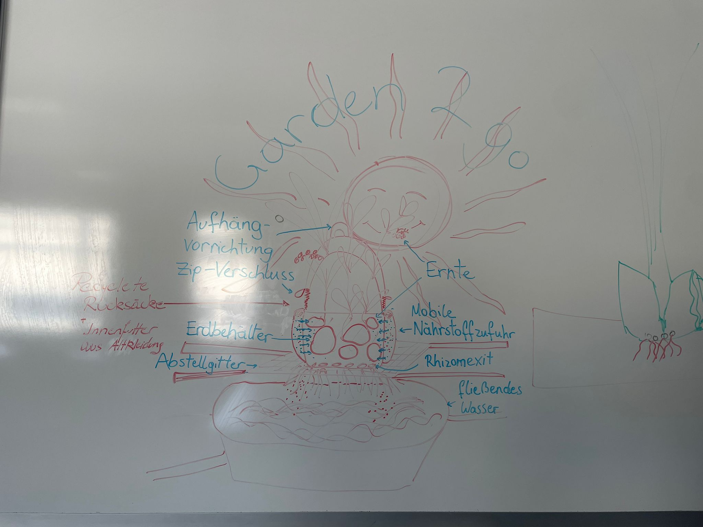

= Projekt Dokumentation
Lydia Reiter
1.0.0, yyyy-mm-dd: name-meeting 2023-07-03

:icons: font
:sectnums:
:toc: left

== 17.10.2024

.Anwesende
|===
|Vorort

|Julia Kiss

|Yaminia Pagoada

|Lydia Reiter

|Lena Wurmsdobler

|Wenxi Yang

|===

.Ort und Datum
[cols=2*]
|===
|Ort
|FH Oberösterreich Hagenberg, FH2.422

|Datum
|Do, 17 Okt 2024
|===

.Notizen Lydia Reiter
[%collapsible]
====

*Personas*

* Personen in der Stadt
* Personen, die mobil sein möchten
* junge Familien
* Garten in der Stadt
* langzeit Camper
* Tiny House Besitzer

**Aufbau**

*Epoxy Harz*

Epoxy Harz verhärtet für

* vereinfachte Transportation
* keine Verwitterung

*Plastik Rucksäcke*

Plastik Rucksäcke werden mit Baumwolle aus Altkleidung eine Innenverkleidung gemacht, um kein Microplastic in die Erde zu geben.

*System requirements*

* Sonne
* fließend Wasser

* anfangs gießen

*App - Zukunftssicht*

App für weitere Infos

* über die Pflanze
* Gartenkalender
* Erde kaufen
* Dünger kaufen
* Gitter für die Abstellung kaufen
* Abo (Samen, Erde, Dünger, ...)
* Samen kaufen (Aufgrund Kooperation mit AcheNoha für Bio Samen)

====

== 23.10.2024

.Anwesende
|===
|Vorort

|Julia Kiss

|Yaminia Pagoada

|Lydia Reiter

|Lena Wurmsdobler

|Wenxi Yang

|===

.Ort und Datum
[cols=2*]
|===
|Ort
|FH Oberösterreich Hagenberg, FH3.311

|Datum
|Mi, 23 Okt 2024
|===

=== Allgemein

Es wurde generell besprochen bezüglich der Präsentation am 25.10.2025.
Bei diese Präsentation soll das ausgedachte Produkt kurz vorgestellt werden.
Bei dieser Präsentation sollen alle zu Wort kommen.

=== Themen und Ablauf

* Einleitungen und kurze Vorstellung des Produktes (Lena Wurmsdobler)
* Vorstellen der User Needs und die definierten Personas (Yaminia Pagoada)
* Beschreiben der Komponenten der Plant2go (Julia Kiss)
* weitere Informationen über die BloomingLamp2grow (Yaminia Pagoada)
* Systemanforderungen und verwendung von Sensoren (Wenxi Yang)
* App und Zukunftsicht (Lydia Reiter)

=== Notizen

.Julia Kiss
[%collapsible]
====
PND – Plant to Go

Wie ist unser Produkt Aufgebaut? Was sind die Komponenten?

Benötigte Umgebung:

* Erd, Sonne, Wasser

Komponenten

* Rucksack
** besteht aus: außer recyclete Rucksacke, für inneren Stoff Innenfutter aus Altkleidung
** Aufhängvorrichtung für einfachere Transportierung
** Zip-Verschluss
** Mobile Nährstoffzufuhr – solche Material, die keine nicht nötige Stoffe ins Erde gehen lässt, damit es kein Umweltsbeschädigung entsteht
* Erdbehalter im Rucksack
* Abstellgitter, um Abstand zwischen Wasser und Wurzeln zu halten
* Rhizom(Wurzel)Exit
* Pflanze + Ernte
* Blumenlampe (Vollspektrum-Licht) im Rucksack, mit drei verschiedene Lichtwellen, die mit Wachstum helfen – Idealerweise funktioniert mit Sonnenenergie

====

.Yaminia Pagoada
[%collapsible]
====

Einleitung Produkt Spezifikationen, Systemrequirements – Lena

* Funktionalität, Nachhaltigkeit, innovatives Design
* Formstabilität

*Personas – Yaminia*

* Der gemeinsame Nenner – wenig Platz, ungünstige Umgebungszustände,
Umzugsbeständig und leicht tragbar, mit der Verfügung zu allen
notwendigen Tools die für eine erfolgreiche Pflanzenzucht notwendig sind.
* In der Stadt,
* Die Mobil leben wollen,
* Junge Familien,
* Garten in der Stadt,
* Langzeitcamper
* Tiny-House Besitzer
* LED-Lichter bieten die Möglichkeit, das Lichtspektrum gezielt auf die
Bedürfnisse der Pflanzen abzustimmen. Blau und Rot sind dabei die
wichtigsten Spektren: Blau (400-500 nm) fördert das vegetative
Wachstum. Rot (600-700 nm) unterstützt die Blüte und
Fruchtentwicklung.
* Für die Blütephase ist ein Zyklus von 12 Stunden Licht und 12 Stunden
Dunkelheit erforderlich, um die Pflanzen zur Blütenbildung anzuregen.
Diese spezifischen Lichtzyklen imitieren die natürlichen
Umweltbedingungen und stimulieren die Pflanzen, entsprechend ihrer
genetischen Programmierung zu reagieren.

Produktbeschreibung – Julia

* Rostfreie Ösen,
* Input Licht - Yaminia

Abo Modell /Welche Saison-Welche Pflanzen– Wenxī

* Anfangs gießen,
* Umweld,
* Epoxidharz,
* Baumwolleinlagen bei Plastikrucksäcke/aus Altkleidung
* Blooming Lamp
* Abomodell

App Sesoren/Timer – Lydia

* Userexperience, was muss man machen, Timer, Collabs mit Arche Noah
* Ev-Hydrokultur in Zukunft

====

.Lydia Reiter
[%collapsible]
====

Julia: Komponenten

Yaminia: Personas User need

Lena: Einleitung und kurze erklärung, Umwelt aspekt

Sisi: Systemrequirements + Sensoren weniger Sensoren Mehr Timer - Wochen

Lydia: Zuküntik App + Kollabaration + Zukunftsicht + Umsetzung - App Samen Kalender + Abo Model
User Experience

Ablauf:

* Lena Generell
* Yamina
* Julia
* Yamina (Infos BloomingLamp2grow)
* Sisi
* Lydia

Community wird "Menschen 2.0" wegen Umwelt und so genannt - Marketing über Tiktok

TODO: Ascidoc + gh + gh page +
Notizen anderer hinzufügen

====

.Lena Wurmsdobler
[%collapsible]
====
Plant2Go

Allgemeine Produktvorstellung

Wir haben uns für den Rucksack entschieden und möchten euch daher unsere
innovative Idee den Plant2Go Rucksack vorstellen.

Der Rucksack wurde von uns als Pflanzenzuchtstation bzw. als Pflanzentopf
umfunktioniert, um auf kleinsten Raum diverses Gemüse und Obst zu jeder Zeit und an
jedem Ort anbauen zu können

Unser Ziel ist es Funktionalität, Nachhaltigkeit, Kreativität und innovatives Design zu
verbinden um umweltbewussten sowie nachhaltigen Personen eine Garten-Experience
zu geben die bislang aufgrund verschiedener Faktoren nicht möglich war.

Warum nachhaltig?

Wir schenken alten Rucksäcken durch Upcycling ein 2. Leben und ergänzen die
Rucksäcke durch weitere umweltfreundliche Features.

Z.B. Für die Langlebigkeit durch eine Epoxidharz-Beschichtung wird Formstabilität
gewährleistet und Verwitterung vermieden.

Oder im Falle eines Plastikrucksacks wird Baumwollinnenfutter aus Altkleidern
eingenäht, was der Verunreinigung durch Mikroplastik entgegenwirkt.

Warum Plant2Go?

*Umweltfreundlich:* Reduziert Müll und spart Ressourcen

*Multifunktional:* Flexibel einsetzbar – vom Outdoor-Abenteuer bis hin zur grünen Oase
im zuhause oder als mobilen Garten.

*Langlebig:* Durch die robusten Materialien hält der Rucksack jegliche Wetterlagen und
schweren Lasten stand
====

.Wenxi Yang
[%collapsible]
====
*Sensoren:*

* um zu wissen wie es der Pflanze geht Nährstoff, Wasser, ph-Wert, Sonnenenergie

*Nährstoffzufuhrüberlegungen Camper*

*Systemrequirements:*

* Man muss es anfangs gießen bis die Wurzeln das Wasser erreichen
* Abstellgitter oder durchlässige Abstellfläche/ aufhängen
* welche Pflanzen anbaut werden richten sich nach der Saison
* das kann man in der App nachschauen
====

